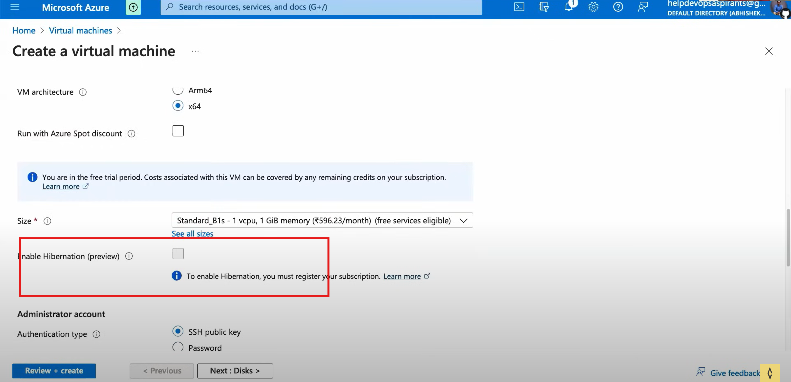

Different vm options when creating VM's
---------------------------------------

## Spot instances
  * VM's that are given which are available now
  * There is no any guarantee that these instances will be there 
  * If there is more requests these machines are given to them
  *  
  * So you can not run production workloads
## ssh login
```sh
# ssh -i /path/to/privatekey.pem username@<public-ip-address>
# -i means identity file 
ssh -i /home/users/kondu/.ssh/id_rsa.pem akhil@10.0.0.0
ssh username@<public-ip>
  # Enter password
ps -ef | grep jenkins  
```
* Always use gitbash when dealing ssh connections
* Virtual Machine Scale Set(Azure) = Auto Scaling Group(AWS)
    * Automatically scale the application based on incoming traffic
* 