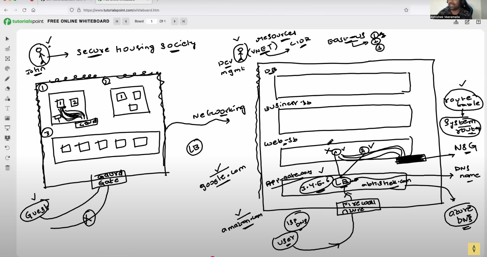

# Azure Networking Advanced

## Azure App Gateway & WAF

Azure Application Gateway is a web traffic load balancer that enables you to manage and route traffic to your web applications. Web Application Firewall (WAF) provides protection against web vulnerabilities. Key features include:

- **Load Balancing**: Distributes incoming traffic across multiple servers to ensure no single server is overwhelmed.

- **SSL Termination**: Offloads SSL processing, improving the efficiency of web servers.

- **Web Application Firewall (WAF)**: Protects web applications from common web vulnerabilities and exploits.

## Azure Load Balancer

Azure Load Balancer distributes incoming network traffic across multiple servers to ensure no single server is overwhelmed. Key features include:

- **Load Balancing Algorithms**: Supports different algorithms for distributing traffic, such as round-robin and least connections.

- **Availability Sets**: Works seamlessly with availability sets to ensure high availability.

- **Inbound and Outbound Traffic**: Balances both inbound and outbound traffic.

## Azure DNS

Azure DNS is a scalable and secure domain hosting service. It provides name resolution using the Microsoft Azure infrastructure. Key features include:

- **Domain Hosting**: Hosts domain names and provides name resolution within Azure.

- **Integration with Azure Services**: Easily integrates with other Azure services like App Service and Traffic Manager.

- **Global Availability**: Provides low-latency responses globally.

## Azure Firewall

Azure Firewall is a managed, cloud-based network security service that protects your Azure Virtual Network resources. Key features include:

- **Stateful Firewall**: Allows or denies traffic based on rules and supports stateful inspection.

- **Application FQDN Filtering**: Filters traffic based on fully qualified domain names.

- **Threat Intelligence Integration**: Integrates with threat intelligence feeds for enhanced security.

## Virtual Network Peering and VNet Gateway

### Virtual Network Peering

Virtual Network Peering allows connecting Azure Virtual Networks directly, enabling resources in one VNet to communicate with resources in another. Key features include:

- **Global VNet Peering**: Peering can be established across regions.

- **Transitive Routing**: Traffic between peered VNets flows directly, improving performance.

### VNet Gateway

VNet Gateway enables secure communication between on-premises networks and Azure Virtual Networks. Key features include:

- **Site-to-Site VPN**: Connects on-premises networks to Azure over an encrypted VPN tunnel.

- **Point-to-Site VPN**: Enables secure remote access to Azure resources.

## VPN Gateway

Azure VPN Gateway provides secure, site-to-site connectivity between your on-premises network and Azure. Key features include:

- **IPsec/IKE VPN Protocols**: Ensures secure communication over the Internet.

- **High Availability**: Supports active-active and active-passive configurations for high availability.

- **BGP Support**: Allows dynamic routing between your on-premises network and Azure.

